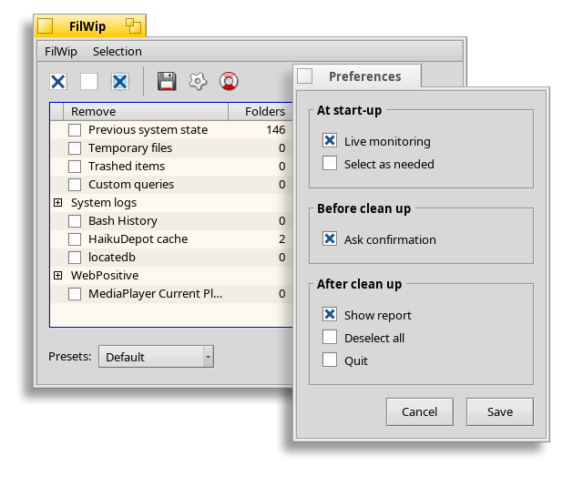

# FilWip v.0.1

FilWip is the BeOS Clean-Up Manager replacement app.

It cleans your hard disk of all unwanted files such as left-over temporary files, cache files of internet sessions, logs, history files and the like. FilWip is the successor of the BeOS Clean-Up Manager. The reason why the Clean-Up Manager was dropped was because it had certain problems that needed almost a complete rewrite to be fixed. It was not worth doing because I wanted to add more features and change the overall approach. So I decided to create a new program and so here is FilWip, and another reason was I wanted a shorter name :P

From your point of view all you have to do is stop using Clean-Up Manager and use FilWip... Afterall that was why you installed it, right? If you are interested in knowing the problems encountered with making/improving Clean-Up Manager read the "CleanMgr.txt", and from my point of view I will try and make FilWip as easy to use and flexible as possible especially after hearing encouraging words of feedback from many members of BeShare and from many others through email. Thank you all!

FilWip v0.1 is the first release. It's graphical user interface should look accurate, consitent and feel responsive as I took a bit of time on designing it. Also the performance of FilWip should be on par with it's predecessor. While Clean-Up Manager was multi-threaded, it had a basic problem with it's threading which actually resulted in in-efficiency and slow down. It was multi-threaded but not in a proper way (to be truthful it was multi-threaded in exactly the opposite way the threading should have been written). FilWip realises this problem and implements multi-threading like how it should have been.

FilWip has all the features of Clean-Up Manager plus it has more. Most of these were based on user's requests such as cleaning cookies of NetPositive seperately, default preset, progress view etc. If you want something implemented, and if it makes sense to be implemented and more importantly if it CAN be implemented I will try my best to add the feature you requested. Just drop me a mail...

Best regards,

- Ram (Somebody)
<ramshankar@themail.com>

FilWip (c) 2002 Ramshankar
All cited trademarks or registered belong to their respective owners.
